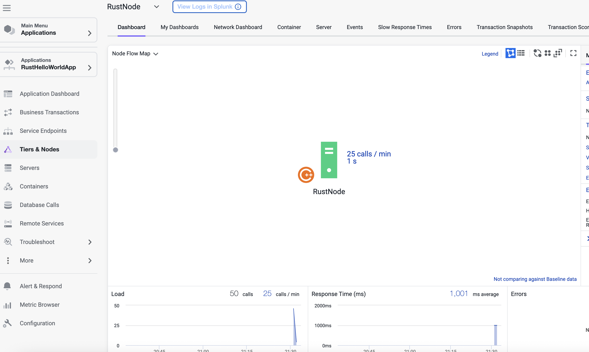
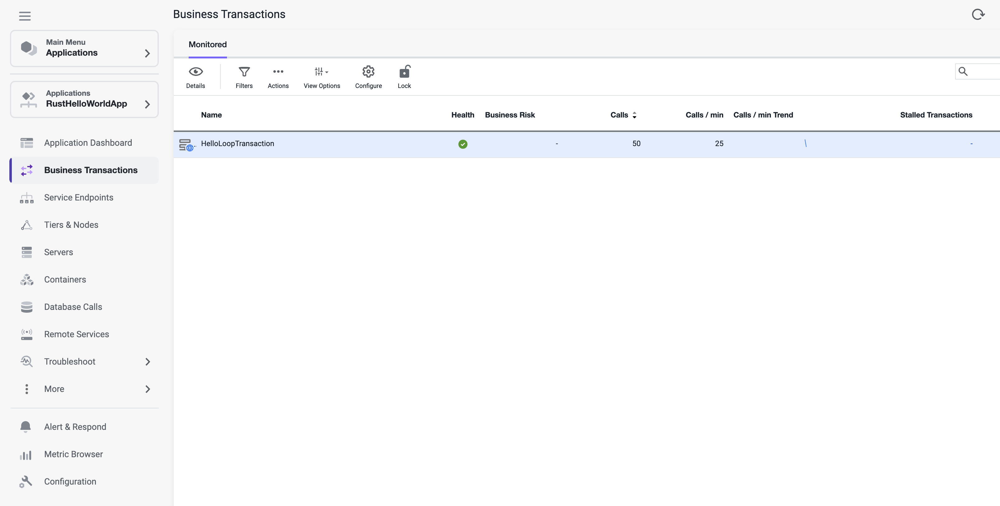

# AppDynamics C++ SDK for Rust

This project demonstrates using the AppDynamics C++ SDK from Rust via FFI (bindgen). It runs a small instrumented demo that reports business transactions to AppDynamics.


## Prerequisites

- **AppDynamics C++ SDK** under `appdynamics-cpp-sdk/` with:
  - `include/` (headers)
  - `lib/libappdynamics.so` (Linux x86_64, glibc ≥ 2.5)
- **Docker** (for building and running the demo image), or a Linux build environment with Rust, `clang`, `libclang-dev`, and a C++ toolchain.


## Build

### Using Docker (recommended)

```bash
docker build -t rust-appd-demo .
```

The image is **linux/amd64**, based on Debian Bookworm (glibc 2.31), which meets the SDK requirement.

### Local build (Linux, for development)

Requires Rust toolchain, `clang`, `libclang-dev`, and `build-essential`. From the repo root:

```bash
cargo build --release
```

Bindings are generated at build time by `build.rs` (bindgen) into `OUT_DIR`, no separate bindgen step is needed.


## Run

### Using Docker

Set the required Controller credentials via environment variables. Example:

```bash
docker run --rm \
  -e APPD_CONTROLLER_HOST=your-controller.saas.appdynamics.com \
  -e APPD_CONTROLLER_ACCOUNT=your-account \
  -e APPD_CONTROLLER_ACCESS_KEY=your-access-key \
  --name appd-test rust-appd-demo
```

To stream container logs to stdout:

```bash
docker logs -f appd-test
```

### Running the binary directly

Export the same variables, then run the release binary (e.g. after `cargo build --release`):

```bash
export APPD_CONTROLLER_HOST=your-controller.saas.appdynamics.com
export APPD_CONTROLLER_ACCOUNT=your-account
export APPD_CONTROLLER_ACCESS_KEY=your-access-key
./target/release/appd-rust-app
```

### Environment variables

| Variable | Required | Description |
|----------|----------|-------------|
| `APPD_CONTROLLER_HOST` | Yes | Controller host (e.g. `tenant.saas.appdynamics.com`) |
| `APPD_CONTROLLER_ACCOUNT` | Yes | Controller account name |
| `APPD_CONTROLLER_ACCESS_KEY` | Yes | Controller access key |
| `APPD_APP_NAME` | No | Application name (default: `RustHelloWorldApp`) |
| `APPD_TIER_NAME` | No | Tier name (default: `RustTier`) |
| `APPD_NODE_NAME` | No | Node name (default: `RustNode`) |

---

## Demo screenshots

| Screenshot 1 | Screenshot 2 |
|--------------|--------------|
|  |  |


## Extend the SDK in Rust

### Project layout

- **`src/main.rs`** – Entry point and demo: config from env, SDK init, loop of business transactions.
- **`src/bindings.rs`** – Includes bindgen-generated bindings from `OUT_DIR`, all `appd_*` functions and types are available there.
- **`build.rs`** – Runs bindgen on `wrapper.h` and the AppD headers, writes bindings to `OUT_DIR`, and links `libappdynamics.so`.
- **`wrapper.h`** – Includes the AppD C API header, keep this and `appdynamics-cpp-sdk/include/appdynamics.h` as the source of truth for APIs.

### Adding instrumentation

1. **Business transactions (BTs)**  
   Pair `appd_bt_begin(name, correlation_header)` with `appd_bt_end(bt)`. Use `std::ffi::CString` for any string passed to the C API and keep the `CString` in scope for the duration of the call.

2. **Exit calls**  
   Declare backends with `appd_backend_declare` / `appd_backend_add`, then wrap outbound calls with `appd_exitcall_begin(bt, backend)` and `appd_exitcall_end(exitcall)`. Use `appd_exitcall_get_correlation_header` when propagating correlation to downstream services.

3. **Errors**  
   Report errors on a BT with `appd_bt_add_error(bt, level, message, mark_bt_as_error)`.


### Using more AppD APIs

- **Headers:** `appdynamics-cpp-sdk/include/appdynamics.h` (and `appdynamics_advanced.h` if needed).
- **Bindings:** Extend `build.rs` allowlists if you need more symbols (e.g. `appd_analytics_*`, `appd_exitcall_*`). Then call the new functions from Rust via the same `bindings` module.
- **Config:** Additional `appd_config_set_*` options can be set in `main.rs` (or your own init code) before `appd_sdk_init(config)`.


## Bindings

Bindings are generated at **build time** by `build.rs` (bindgen) into `OUT_DIR` and included from `src/bindings.rs`. Only `appd_*` functions/types and `APPD_*` constants are allowlisted. Regeneration is automatic on each build, no manual bindgen or committed binding files are required.
